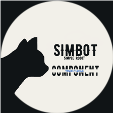

<div align="center">
    
    <h2>
        - simple-robot-component -
    </h2>
    <h4>
        ~ tencent-guild ~
    </h4>
</div>

<br>

# 建设中。。


基于 [simple-robot](https://github.com/ForteScarlet/simpler-robot) 3.x版本API的 `simple-robot` 组件。


## 事件支持

目前，组件对core下事件的支持：
- TcgGuildModifyEvent -> 频道服务器相关事件
  - TcgGuildModifyEvent.Create -> 频道服务器 - 进入
  - TcgGuildModifyEvent.Update -> 频道服务器 - 更新
  - TcgGuildModifyEvent.Delete -> 频道服务器 - 离开
- TcgGuildMemberEvent -> 频道服务器成员相关事件
  - TcgGuildMemberEvent.Increase -> 成员 - 增加
  - TcgGuildMemberEvent.Decrease -> 成员 - 减少
- TcgChannelModifyEvent -> 子频道相关事件
  - TcgChannelModifyEvent.Create -> 子频道 - 新增
  - TcgChannelModifyEvent.Update -> 子频道 - 信息变更
  - TcgChannelModifyEvent.Delete -> 子频道 - 删除
- TcgChannelAtMessageEvent -> 被At消息事件


当然，这不影响你直接使用 `tencent-guild-core` 中定义的事件，但是你无法使用下述的诸如调度器、拦截器等内容。


## 使用
### Maven

```xml
<dependency>
    <groupId>love.forte.simple-robot</groupId>
    <artifactId>component-tencent-guild</artifactId>
    <version>0.0.3</version>
</dependency>
```

### Gradle groovy

```groovy
implementation "love.forte.simple-robot:component-tencent-guild:$version"
```

### Gradle kotlin DSL

```kotlin
implementation("love.forte.simple-robot:component-tencent-guild:$version")
```


## 示例
### 事件调度管理器
首先，根据 `simple-robot`, 你需要一个 `EventListenerManager` 来作为针对一系列事件的 **调度入口**, 而 `simple-robot-core` 为我们提供了一个`coreEventManager`:
```kotlin
// 最简配置
val eventManager = coreListenerManager {
    // 配置，例如拦截器
}
```

上面的示例提到了拦截器，如果要配置拦截器可以这样：
```kotlin
val eventManager = coreListenerManager {
    // 配置拦截器
    interceptors {
        // 事件流程拦截器，提供一个唯一的拦截器ID
        processingIntercept(114514.ID) {
            println("Processing Intercept 1 start")
            it.proceed() // 下一段拦截器，或者真正的逻辑
                .also {
                    println("Processing Intercept 1 end")
                }
        }
        // 监听函数拦截器，提供一个唯一的ID
        listenerIntercept(1.ID) {
            println("Listener Intercept 2 start")
            it.proceed()
                .also {
                    println("Listener Intercept 2 end")
                }
        }
    }
}
```

有关拦截器的概述，可以参考 `simple-robot 3.x` 文档：[定义概述 - 拦截器](https://www.yuque.com/simpler-robot/simpler-robot-doc/gg762t)


### 注册事件
向 `EventListener` 中注册事件是通过注册 `EventListener` 实例完成的，你可以构建一个最基础简单的监听器：
```kotlin
val listener = coreListener(eventKey = ChannelMessageEvent) { context: EventProcessingContext, event: ChannelMessageEvent ->
    // do 
}
```

可以看到，通过 `coreListener` 的 `eventKey` 指定一个监听的事件类型，此处以 `ChannelMessageEvent` 为例。
此事件类型是由 `simple-robot-api` 进行定义的规范事件，
当然，对于当前库来讲，你也可以监听一个QQ频道专属的事件，例如：
```kotlin
val listener = coreListener(eventKey = TcgChannelAtMessageEvent) { context: EventProcessingContext, event: TcgChannelAtMessageEvent ->
    // do
}
```

这次监听的事件类型便是 `TcgChannelAtMessageEvent`, 代表的是 `tencent guild channel at message event`, 也就是腾讯频道的AT_MESSAGE事件。
这个事件继承自 `ChannelMessageEvent`, 因此使用上面提到的标准事件类型也可以监听到。

至于这个事件的使用：
```kotlin
val listener = coreListener(eventKey = TcgChannelAtMessageEvent) { context: EventProcessingContext, event: TcgChannelAtMessageEvent ->
    // 一次事件流程的上下文
    println(context)
    // 此消息事件的子频道
    val channel: TencentChannel = event.source

    // 子频道的外部频道
    val guild: TencentGuild = channel.guild()

    // 这个频道的所有子频道
    val children: Flow<TencentChannel> = guild.children()

    children.collect {
        println("Channel: ${it.name}")
    }

    // 发送消息,
    // 目前支持:
    // Text
    // At
    // Ark(tencent guild 专属)
    // AttachmentMessage(tencent guild 专属)
    // MentionChannel(tencent guild 专属)
    // ReplyTo(tencent guild 专属)

    // 🌟 消息：@事件发送者 你好啊
    // channel.send(At(event.id) + Text { "你好啊！" }) // err
    
    // ⚠️ 注意！目前来看，频道bot不一定能够允许直接发送消息，因此目前有两种方案：
    // 1. tencent-guild 模块会提供一个特殊的Message用于拼接：ReplyTo(xxx.ID)
    // 比如：At(123.ID) + Text { "233" } + ReplyTo(xxx.ID)
    // 但是这种情况仅限于你知道message的ID是什么
    
    // 2. event.reply
    event.replyIfSupport(At(event.id) + Text { "你好啊！" })
    
    // 如果你监听的是 TcgChannelAtMessageEvent，那么可以直接使用 event.reply
    event.reply(Text{ "HELLO!" })

    null // 事件返回值，爱是啥是啥
}
```

注册到bot管理器：
```kotlin
listenerManager.register(listener)
```

当然，你也可以直接用以下方式注册，而不需要提前创建Listener实例：
```kotlin
listenerManager.listen(eventKey = ChannelMessageEvent) { context, event ->
    
    // do something

    null // result
}
```


### BOT管理器
事件调度管理器结束后，便需要一个Bot管理器。根据 `simple-robot` 规范，所有的Bot应全部产出自其专属的 `BotManager` 并由其进行统一管理。
在 `component-tencent-guild`, 提供了一个此模块下专属的bot管理器：
```kotlin
// 注意！botManager 必须配置一个事件管理器，也就是一开始创建的东西。
val botManager = tencentGuildBotManager(listenerManager) {
    
    // 考虑到目前bot最常见的事件是 AT_MESSAGE, 这里统一配置所有bot的设置，让他们只监听 AT_MESSAGE。
    // botConfigure 是所有注册的bot的前置配置器。
    botConfigure = { appId, appKey, token ->
        intentsForShardFactory = { EventSignals.AtMessages.intents }
    }
}
```

然后，我们注册一个BOT。 这里我们直接使用 `tencentGuildBotManager` 提供的专属注册方法：
```kotlin
val bot: TencentGuildBot = botManager.register(appId, appKey, token) {
    // 这里也可以进行单独配置。 
    intentsForShardFactory = { EventSignals.AtMessages.intents }
}
```

到这里，可以启动bot了: 
```kotlin
bot.start()

bot.launch {
    delay(1.hours)
    bot.cancel() // 假设1小时候关闭
}

// 或者干点儿别的
bot.guilds().collect { println("Guild: ${it.name}") }

bot.join() // 直到关闭
```


### 最简示例：
```kotlin
val listenerManager = coreListenerManager {
    // 配置
}

val botManager = tencentGuildBotManager(listenerManager) {
    // config
}

// 事件监听
listenerManager.listen(eventKey = ChannelMessageEvent) { context, event ->
    // do
    
    // result
    null
}

val bot: TencentGuildBot = botManager.register(appId, appKey, token) {
    intentsForShardFactory = { EventSignals.AtMessages.intents }
}

// start
bot.start()

// join 
bot.join()
```

