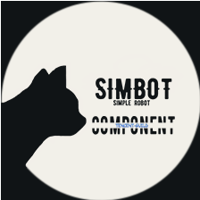

# Core

<div align="center">
    
    <h2>
        - simple-robot-component : tencent-guild -
    </h2>
    <h4>
        ~ stdlib ~
    </h4>
    <br />
<a href="https://repo1.maven.org/maven2/love/forte/simbot/component/simbot-component-tencent-guild-stdlib" target="_blank">
  </a>
<a href="https://www.yuque.com/simpler-robot/simpler-robot-doc" target="_blank">
  </a>
<hr />
</div>


core模块是针对bot事件监听的简易实现，是一个半 **底层** 库，仅提供最基础的 DSL 事件注册，不提供过多的应用级功能整合（例如依赖注入、自动扫描等等）

如果你想使用更友好更高阶的使用，请关注 [simple-robot](https://github.com/ForteScarlet/simpler-robot)
框架的3.x版本发布情况。更友好的应用级实现将会通过 `simple-robot` 的组件进行实现与提供。

## 使用

本库，目前仅基于 `simple-robot 3.0.0-preview.x.x` 版本api，从版本可以看出来，simbot 3.x的版本仍然处于极早期的预览阶段， 因此当前模块也相应的仅仅只是一个"预览"版本。

本库将会 `simple-robot` 3.x发布时（或相对较其早的时刻）发布相应的正式版本。主要是因为 `simple-robot 3.x` 仍处于设计开发阶段，可能会出现一些接口变动。

## 目前情况

- 测试了基本的 `AT_MESSAGE` 事件接收与对此消息事件通过 `MessageSendApi` 进行回复（测试频道，语料无限制情况下）。
- 测试了获取bot的guild列表。
- 测试了一周以上的挂机。

### Maven

版本参考：*见头部图标*

```xml

<dependency>
    <groupId>love.forte.simbot.component</groupId>
    <artifactId>simbot-component-tencent-guild-stdlib</artifactId>
    <version>${version}</version>
</dependency>
```

### Gradle groovy

```groovy
implementation "love.forte.simbot.component:simbot-component-tencent-guild-stdlib:$version"
```

### Gradle kotlin DSL

```kotlin
implementation("love.forte.simbot.component:simbot-component-tencent-guild-stdlib:$version")
```

## 示例

### Kotlin

```kotlin

suspend fun main() {
    val bot = tencentBot(appId = "app_id", appKey = "app_key", token = "token") {
        serverUrl = TencentGuildApi.URL // or TencentGuildApi.SANDBOX_URL, 或者自定义

        // 假设监听 AT_MESSAGE 事件。
        // 假设所有分片下都要监听 "AT_MESSAGE" 事件。
        intentsForSharedFactory = { EventSignals.AtMessages.intents }

        // 其他自定义配置

    }

    // start bot, 即尝试进行ws连接。
    bot.start()
    
    // 所有事件都存在于 EventSignals 下的子类型中。

    // 指定监听事件类型1 - 会自动decode数据为目标事件所提供的数据。
    bot.processor(EventSignals.AtMessages.AtMessageCreate) { message ->
        println(message)

        val api = MessageSendApi(channelId = message.channelId, content = "我在！", msgId = message.id)
        // 发送回复消息
        val result = api.request(bot) // 可以注意到，在core模块下，可以直接通过 Api.request(bot) 来提供bot进行api请求。
        println(result)
    }

    // 添加事件1 - 不加过滤, 不会自动decode json数据, 但是提供decoder和json data
    bot.processor { decoder ->
        val dispatch: Signal.Dispatch = this
        val jsonElement: JsonElement = dispatch.data
        if (dispatch.type == "AT_MESSAGE_CREATE") {
            val message: TencentMessage =
                decoder.decodeFromJsonElement(EventSignals.AtMessages.AtMessageCreate.decoder, jsonElement)

            println(message)
        }
        // do something..
    }

    // 指定监听事件名称1 - 不会自动decode json数据, 但是提供decoder和json data
    bot.processor("AT_MESSAGE_CREATE") { decoder ->
        val dispatch: Signal.Dispatch = this
        val message: TencentMessage =
            decoder.decodeFromJsonElement(EventSignals.AtMessages.AtMessageCreate.decoder, dispatch.data)

        println(message)
    }

    // 指定监听事件名称2 - 不会自动decode json数据, 但是提供decoder和json data
    bot.processor(EventSignals.AtMessages.AtMessageCreate.type) { decoder ->
        val dispatch: Signal.Dispatch = this
        val message: TencentMessage =
            decoder.decodeFromJsonElement(EventSignals.AtMessages.AtMessageCreate.decoder, dispatch.data)

        println(message)
    }

    bot.launch {
        delay(10_000)
        // 模拟bot关闭
        bot.cancel()
    }

    // join bot
    // 挂起直到bot被关闭
    bot.join()

}
```

可以看到，上述示例中，对一个bot注册事件通过 `bot.processor { ... } ` 进行注册。

对于所有的事件类型（以及他们的数据类型定义）都囊括在 `EventSignals` 的子类中，你可以直接参考此类的源码定义。

### Java

```java
TencentBot bot=TencentBotFactory.newBot("appId","appKey","token",c->{
        // Listen AT_MESSAGES
        c.intentsForShardFactoryAsInt(shard->EventSignals.AtMessages.getIntentsValue());

        // config.. 

        return Unit.INSTANCE;
        })

// 事件处理
        bot.process(EventSignals.AtMessages.AtMessageCreate.INSTANCE,(tencentMessage)->{

        System.out.println(tencentMessage.getContent());

// 构建API
final MessageSendApi sendApi=new MessageSendApi(tencentMessage.getChannelId(),"Hi",tencentMessage.getId());

// 发送消息
final TencentMessage result=BotRequestUtil.doRequest(bot,sendApi);

        System.out.println(result);

        return Unit.INSTANCE;
        });

        bot.startBlocking()
        bot.joinBlocking()

```

